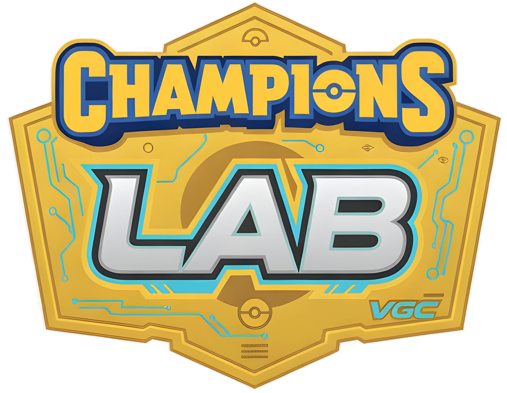

<p align="center">
  
</p>

<h1 align="center">Champions Lab</h1>

<p align="center">
  <strong>The ultimate competitive companion for Pokémon Champions 2026</strong>
</p>

<p align="center">
  <a href="https://championslab.xyz">🌐 Live Site</a> · 
  <a href="#features">✨ Features</a> · 
  <a href="#tech-stack">🛠 Tech Stack</a> · 
  <a href="#getting-started">🚀 Getting Started</a> · 
  <a href="#battle-engine">⚔️ Battle Engine</a>
</p>

<p align="center">
  
  
  
  
  
</p>

---

## What is Champions Lab?

Champions Lab is a **full-featured competitive Pokémon web app** built for the VGC (Video Game Championships) doubles format. Browse a curated roster of **147 Pokémon**, draft teams with an interactive builder, simulate **1,000,000+ battles** with a Monte Carlo engine, study the meta with ML-generated rankings, and learn competitive fundamentals — all from a single, beautifully crafted hub.

> **Live at [championslab.xyz](https://championslab.xyz)**

---

## Features

### 📖 Pokédex & Season Hub
Browse **147 competition-legal Pokémon** (136 base + 11 regional forms) with full stats, abilities, move pools, and tier rankings. Filter by type, generation, tier, or Mega Evolution status. Every Pokémon has a detailed modal with Stats, Moves, Abilities, Usage, and Teams tabs.

### 🧩 Team Builder
Drag-and-drop team creation for up to 6 Pokémon. Includes:
- **SP System** — 66 Stat Points per Pokémon (max 32 per stat), replacing traditional EVs/IVs
- Move, ability, nature, item, and Tera Type selection
- AI-powered **teammate suggestions** and set recommendations
- **Synergy analysis** — role coverage (sweeper, wall, pivot, support), type overlaps, core pair detection
- **Save, load, share** (compressed URLs via pako), and **import/export** in Showdown format

### ⚔️ Battle Bot
A **Monte Carlo doubles battle simulator** that runs realistic 4v4 matches with:
- Intelligent AI move selection and switching logic
- Detailed turn-by-turn battle logs
- Win/loss tracking and battle replays
- The same engine that powered 1M+ simulations for the meta rankings

### 📊 META Analysis
Data-driven competitive meta dashboard generated from **1,000,000+ simulated battles**:
- **Pokémon Rankings** — ELO ratings and win rates for every Pokémon
- **Tournament Teams** — Real competitive teams and compositions
- **Core Pairs** — Best partner combinations backed by data
- **Archetype Matchups** — How team styles perform against each other
- **Move Analysis** — Most effective moves by usage and win rate

### 🎓 PokéSchool
Educational hub for new and intermediate competitive players:
- VGC ruleset explained (Doubles, Bring 6 Pick 4, Team Preview)
- Role guides — what makes a good sweeper, wall, or support?
- Strategy fundamentals for the Champions format

---

## Tech Stack

| Technology | Purpose |
|:--|:--|
| [Next.js 16](https://nextjs.org/) | App Router, SSR, static generation |
| [React 19](https://react.dev/) | UI components with latest features |
| [TypeScript](https://www.typescriptlang.org/) | End-to-end type safety |
| [Tailwind CSS v4](https://tailwindcss.com/) | Utility-first styling |
| [Framer Motion](https://www.framer.com/motion/) | Animations & transitions |
| [shadcn/ui](https://ui.shadcn.com/) | Accessible component primitives |
| [dnd-kit](https://dndkit.com/) | Drag-and-drop team reordering |
| [Supabase](https://supabase.com/) | Database & authentication |
| [Pako](https://github.com/nodeca/pako) | Deflate compression for share URLs |
| [Zod](https://zod.dev/) | Runtime schema validation |

---

## Battle Engine

The heart of Champions Lab is a custom-built **Monte Carlo battle simulator** in TypeScript that models VGC doubles with 30+ game mechanics:

```
src/lib/engine/
├── battle-sim.ts       # Core doubles battle simulator with AI
├── damage-calc.ts      # Gen 9 damage formula (SP system)
├── stat-calc.ts        # Stat Point calculations (Lv.50, 31 IVs)
├── ml-runner.ts        # 1M battle orchestrator with ELO matchmaking
├── team-generator.ts   # Archetype-based team generation
├── generated-teams.ts  # 15+ curated competitive teams (S/A/B tier)
├── synergy.ts          # Role detection & synergy scoring
├── move-data.ts        # 850+ moves with full effect data
├── ability-data.ts     # 200+ ability implementations
├── type-chart.ts       # 18×18 type effectiveness matrix
├── natures.ts          # 25 natures with stat modifiers
├── items.ts            # Competitive item effects
├── vgc-data.ts         # Tournament data & archetypes
├── suggestions.ts      # AI teammate & set recommendations
└── index.ts            # Public API
```

### Implemented Mechanics
- Mega Evolution (1 per team max)
- Tera Type crystallization
- Weather (Sun, Rain, Sand, Snow) & Terrain
- Spread moves & single-target in Doubles
- Priority brackets & speed tiebreaking
- Status conditions (Burn, Paralysis, Poison, Freeze, Sleep)
- Stat stages (-6 to +6) & critical hits
- Screens (Reflect, Light Screen, Aurora Veil)
- Abilities modifying damage, weather, stats, and more
- Item effects (Life Orb, Choice items, Berries, etc.)

---

## Getting Started

### Prerequisites

- **Node.js** 18+
- **npm** or your preferred package manager

### Installation

```bash
# Clone the repository
git clone https://github.com/Andrew21P/ChampionsLab.git
cd ChampionsLab/champions-lab

# Install dependencies
npm install

# Set up environment variables
cp .env.local.example .env.local
# Edit .env.local with your Supabase credentials

# Start development server
npm run dev
```

Open [http://localhost:3000](http://localhost:3000) in your browser.

### Build for Production

```bash
npm run build
npm start
```

---

## Project Structure

```
champions-lab/
├── src/
│   ├── app/                # Next.js App Router pages
│   │   ├── page.tsx        # Pokédex & Season Hub
│   │   ├── team-builder/   # Interactive Team Builder
│   │   ├── battle-bot/     # Battle Simulator
│   │   ├── meta/           # META Analysis Dashboard
│   │   └── learn/          # PokéSchool
│   ├── components/         # Reusable UI components
│   └── lib/
│       ├── engine/         # Battle simulation engine (15 files)
│       ├── pokemon-data.ts # Full roster (147 Pokémon)
│       ├── usage-data.ts   # Competitive set presets
│       └── types.ts        # Shared TypeScript types
├── public/                 # Static assets & logo
├── scripts/                # Data processing utilities
└── supabase/               # Database schema
```

---

## Season Format

| | |
|:--|:--|
| **Format** | Doubles (Bring 6, Pick 4) |
| **Level** | Auto-scaled to 50 |
| **Stat System** | 66 Stat Points per Pokémon (max 32/stat) |
| **Roster** | 147 Pokémon (Season 1) |
| **Megas** | Supported (1 per team) |
| **Tera Types** | Full Tera crystallization |
| **Tiers** | S · A · B · C · D |

---

## Contributing

Contributions are welcome! Feel free to open issues or submit pull requests.

1. Fork the repository
2. Create your branch (`git checkout -b feature/my-feature`)
3. Commit your changes (`git commit -m 'Add my feature'`)
4. Push to the branch (`git push origin feature/my-feature`)
5. Open a Pull Request

---

## License

This project is open source under the [MIT License](LICENSE).

---

<p align="center">
  Built with ❤️ for the competitive Pokémon community
  <br />
  <a href="https://championslab.xyz"><strong>championslab.xyz</strong></a>
</p>